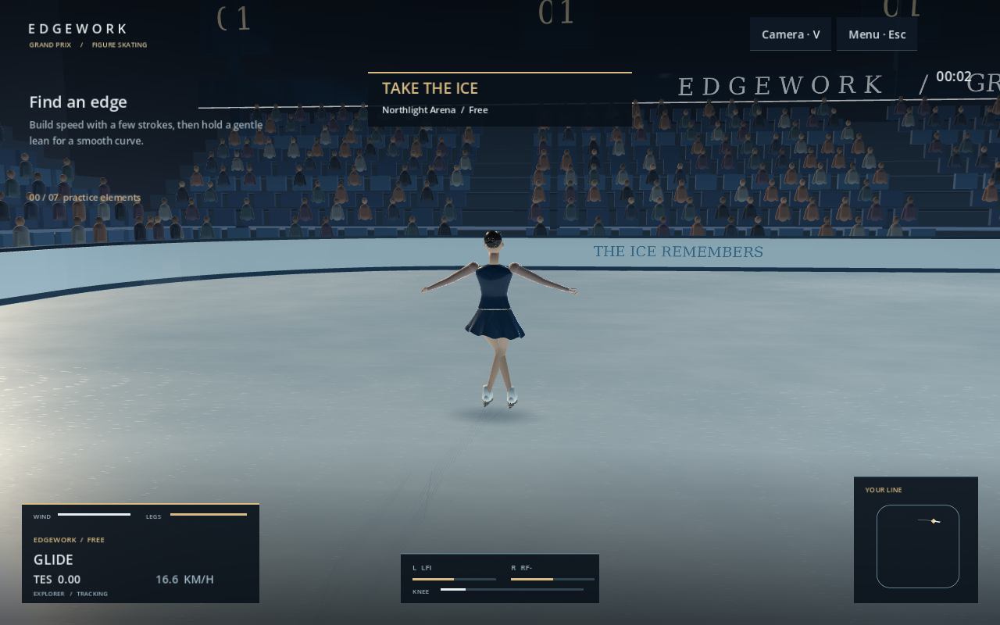
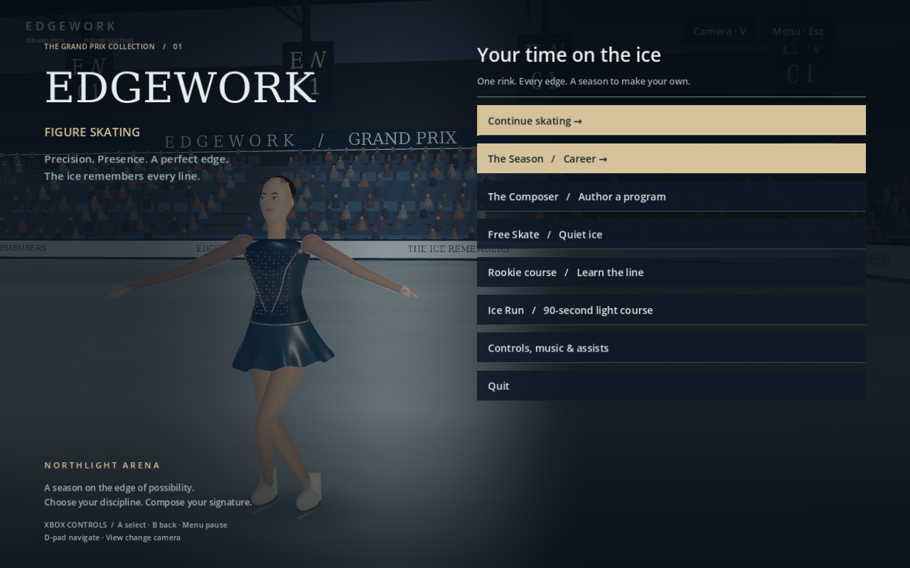

# EDGEWORK / Grand Prix — Native 3D edition

A playable 3D skating prototype with career choreography, authored programs,
replays and the original Ice Lab simulation. Godot handles the rink, rigged skater,
cameras, sound and interface. A local Node process runs Ice Lab at 120 simulation
ticks per second; no network service is involved.

## Northlight presentation rebuild · 2026-09-27



A PS3-era sports presentation direction: a cool competition arena with champagne
accents, satin and crystal costumes, persistent blade cuts, and restrained broadcast
information. These are actual game captures, not concept art.

- **Arena:** four raked spectator banks with instanced seats and spectators,
  structural columns, triangulated roof trusses, luminaires, event banners,
  rink boards and a centre-hung scoreboard. The physical rink dimensions remain
  the solver's rounded-square boundary.
- **Athlete:** a new editable Blender competition model with continuous weighted
  elbows/knees, shaped anatomy, fingers, facial features, braided bun, embroidery,
  two-layer skirt, laces, leather soles, curved steel blades and toe picks.
  The original Violet and Berserker models remain selectable.
- **Materials:** procedural ice grain and grooming marks, a venue reflection probe,
  satin weave, restrained skirt flutter, a soft
  contact shadow and slip-driven ice particles. Dynamic poses reflect actual
  blade contacts, knee pressure, trunk twist, jumps, camel/sit spins and spirals.
- **Broadcast:** technical total, speed, left/right support loads, knee pressure,
  wind and leg stamina, spin level, a local rink path, and landing announcements.
- **Cameras:** Tracking, Broadcast, Rink and Blade. View / V cycles cameras;
  airborne camera changes remain locked. The menu uses an orbiting athlete view.
- **Sound/input:** filtered blade scrape, a quiet synthetic crowd bed, landing
  thuds and crowd swells, optional landing vibration, disconnect-to-pause,
  native Elite paddle presets, and F11 fullscreen.
- **Wardrobe:** Northlight joins Violet, Aurora and Solstice in the shared costume
  catalog. Saved costume choices are preserved; new native sessions use Northlight.



All four existing control setups remain available. Experimental retains its
trigger-driven strokes and cannot accidentally enable Cruise through a saved setting.
Select **Controls, music & assists** to review bindings. Native paddle presets are
Paddle 1–4 → LB/RB/A/R3 (Footwork) or X/B/A/Y (Moves); leave them on the controller's
own profile unless the driver actually exposes separate paddle inputs.

Build from the repository root with `npm run build:native`, or launch the source
project with `npm start`. The browser game is now `npm run start:browser`.

## Play

Tested with **Godot 4.7.2**, **Node 26**, **Blender 5.2.2** and FFmpeg on Linux.
Node 24+ and FFmpeg are needed to prepare the project. Blender is only needed to
edit or regenerate the skater; the `.blend` source and playable `.glb` are included.

From the repository root:

```sh
./games/ice-run-godot/run.sh
```

The launcher prepares the simulation and music, imports Godot resources, then
opens the game. Set `GODOT_BIN` if your editor executable is not named `godot4`.
Set `ICE_RUN_NODE` if the game should use a particular Node executable.

To work in the editor instead:

```sh
node games/ice-run-godot/tools/prepare.mjs
godot4 --editor --path games/ice-run-godot
```

Press **F6/F5** to run the main scene/project. Select **The Season** for five
career events or **The Composer** to build and reorder a program of up to sixteen
phrases — glide, edge, crossover, jump, spin, **step sequence**, and closing pose.
Gold requires no falls; silver permits two; completing the routine earns
bronze. Improved medals earn training XP and unlock the next event. Rehearsals
and replay playback cannot earn career rewards.

Career and Composer results show the jump protocol in program order, with a
numbered row per element and separate TES, PCS, fall deduction and segment total
rows. Combinations remain one row (`+`); invalid repeats retain their `*` mark.
Programs without scored jumps say so explicitly. Scroll the results to read long
sheets and reach the replay/retry controls; keyboard focus follows those controls.
These are the simulation's existing scores, and medals still depend on falls.

Free Skate, the guided Rookie course and the 90-second light course are also
available. Controls, music and assists includes five tracks and free-skate
profiles; career uses its own trained profile.

**Full repertoire** is available in Settings as the fourth scheme. Open
**Controller tuning & bindings** to tune sensitivity, view its layout, or import a
profile exported by the browser workshop. See the
[full control layout and workshop runbook](../../docs/controller-scheme.md).
The table below describes the original schemes; in Full repertoire, LT only brakes,
R3 is toe pick/foot change, and J/D-pad up requests a loop turn.

| Action | Keyboard | Controller |
| --- | --- | --- |
| Carve / steer | A / D | Left stick |
| Push / recover | Space | A |
| Load, then release a jump | Shift | Right trigger |
| Assisted jump (Beginner only) | J | D-pad up |
| Spin / turn / twizzle | Y / B / Z | Y / B / X |
| Low pose | U | D-pad down |
| Wind-up before jump release | Comma (,) | Right stick flick (schemes A/B) |
| Foot selection | Q / E | Left / right shoulder |
| Brake | X | Hold left trigger |
| Toe pick | F | Tap left trigger |
| Ina Bauer | I | Both shoulders |
| Bracket | N | Right stick click |
| Pause / restart | Esc / R | Menu / restart through menu |
| Camera | V | View |

The lower-left HUD carries a running jump TES total and, once you finish one,
the ISU level your last spin actually reached ("Last spin: level 2", or
"level B" below level 1) — the same live readout the browser game's
`#technical`/`#spin-level` already have. `bridge/engine.mjs` scores it with
`sim/spinLevel.ts` the moment a spin ends, the same way it already scored
jump TES; before that, `scripts/main.gd` had nowhere to read a spin level
from at all.

Settings and the authored sequence save to `preferences.json`; career saves
atomically to `career-v1.json`. Both are in Godot's user data directory (normally
`~/.local/share/godot/app_userdata/EDGEWORK · Ice Run/` on Linux). The settings
screen also exports the current replay and session measurements to that directory.
Smoke tests and screenshot captures use separate per-process test saves.

The combined solver uses replay identity `ice-lab-f64/35`. The rocker/counter
exit-lobe correction changed solver arithmetic after `/21`; older replays need
their original solver or must be re-recorded. Incompatible formats are rejected,
not silently migrated.
Career saves retain their existing version and are unaffected by this replay change.

## Build and verify

```sh
# Prepare only simulation code/data, with no Blender or FFmpeg requirement:
node games/ice-run-godot/tools/prepare.mjs --engine-only
node --test games/ice-run-godot/tests/*.test.mjs

# Run the real Godot presentation and local engine through the first routine:
godot4 --headless --path games/ice-run-godot -- --smoke-test

# Build a Linux executable with matching Godot export templates installed:
node games/ice-run-godot/tools/export.mjs
./games/ice-run-godot/exports/linux/ice-run.x86_64
```

Run the full preparation command before the first Godot smoke test: `--engine-only`
does not convert the music. The exporter follows Godot's
[command-line export workflow](https://docs.godotengine.org/en/stable/tutorials/export/exporting_projects.html#exporting-from-the-command-line).
It places the engine bridge and prepared runtime beside the executable because
Node reads ordinary files, not the Godot resource pack. Keep the entire export
directory together. **Node must still be installed**; this is a Linux development
build, not a self-contained installer. Builds and generated music are ignored by Git.

The bridge tests compare 240 solver ticks directly, check original source hashes,
complete a routine, verify disk persistence and training, and verify that replays
do not award XP. CI runs these alongside the browser game's existing tests.

To regenerate the skater from the procedural Blender authoring script:

```sh
blender --background --python games/ice-run-godot/tools/build_skater.py
```

This replaces both the source `.blend` and exported `.glb`; save manual Blender
edits separately before regenerating.

**A second, selectable skater** — the Black Berserker — is built the same way,
from `tools/build_berserker.py`, to `assets/source/skater-berserker.blend` and
`assets/generated/skater-berserker.glb`. Pick it from Settings → Skater; the
choice is saved to `preferences.json` and takes effect on your next skate.
`scripts/skater.gd` poses whichever glb is loaded purely by bone name (`Hips,
Spine, Head, Thigh/Shin/Foot L/R, Arm/Forearm L/R`) every frame, straight from
the physics state — a bone it does not find is simply left in its rest pose,
never an error — so both build scripts construct the identical skeleton
`build_skater.py` originated, and a third character only needs to do the same.

**Costumes** are the browser's own presets (`tools/ice-lab/game/appearance.ts`'s `SKINS`, sent in the
bridge's catalog), not a Godot copy. Settings → Costume recolours Violet at runtime:
`scripts/skater.gd` matches `build_skater.py`'s material names — bodice, skirt, sleeves, crystal trim,
hair, skin and tights, each its own slot — and overrides their albedo. The choice is saved with the
other preferences. The Berserker has no such slots and keeps its authored look. A costume's `bun`
field is not honoured: the hair is one joined mesh, so every costume wears the sculpted bun. The
smoke test fails if fewer than all seven slots take the costume; `--capture --costume=N` screenshots one.

## Design direction and current limits

The requested design-bible adherence is a direction for this rebuild,
not a claim that 75% of the full production specification has shipped. The bible
itself remains the reference; the user authorized Godot in place of Unreal.

| Bible priority | This slice |
| --- | --- |
| Edges and pressure drive skating | Original Ice Lab solver, control schemes, move requests, jump physics and scoring tables; no second Godot movement solver |
| Programs are authored | Ordered Composer phrases, reorder/remove controls, saved sequence and live objectives; no spatial transition planner or music timeline yet |
| Ice records the performance | Both blades leave visible traces, retained for the current run up to 18,000 segments; no friction feedback, snow grid or tracing export yet |
| Restrained theatrical presentation | 3D arena, procedural skeletal posing, thin edge ribbon, five music tracks and three cameras; no camera switch during an airborne jump |
| Career progression | Five events, medals, unlocks and four trainable skills; one shared arena, no season simulation or economy yet |

All current Ice Lab TypeScript modules (54 in this build) are prepared without rewriting their
logic. The host invokes the solver and gameplay modules; copying the browser app
modules does not make every browser UI feature a Godot feature. This is a Godot
presentation around the original engine, **not a native GDScript/C++ physics port**.
The character uses a small procedural rig, not motion-captured animation. Full
cloth simulation, photorealistic character art, planar reflections, and the complete
judging model remain future work. Stamina is exposed in the HUD; existing enabled
flow and ice systems remain owned by Ice Lab. The reflected fixture highlights are
procedural plus a venue reflection probe, not a live planar mirror.

## Rebuild the competition athlete

```sh
blender --background --python games/ice-run-godot/tools/build_competition_skater.py
```

The source is `assets/source/skater-competition.blend`; the runtime asset is
`assets/generated/skater-competition.glb`. This authoring script leaves the
original two character assets intact. The new shaders are in `shaders/`; the
venue and broadcast display are authored in `scripts/arena.gd` and
`scripts/broadcast.gd`. See [delivery notes](../../docs/grand-prix-build.md) for
verification and research boundaries.
